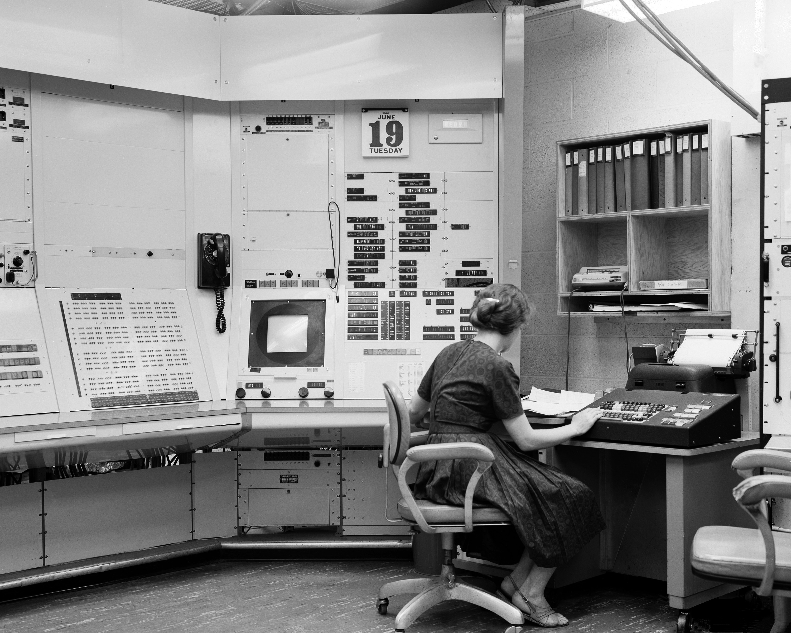
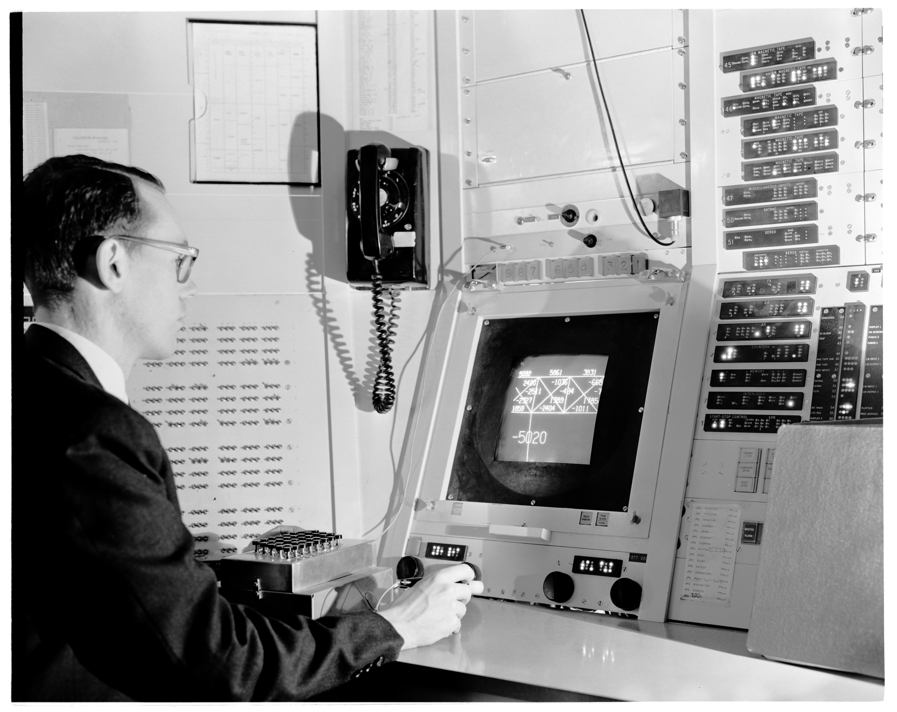
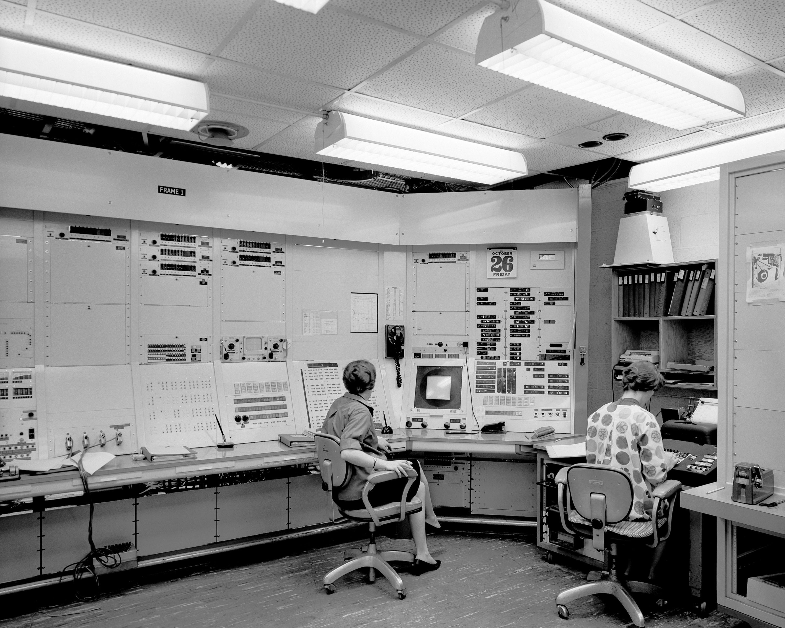
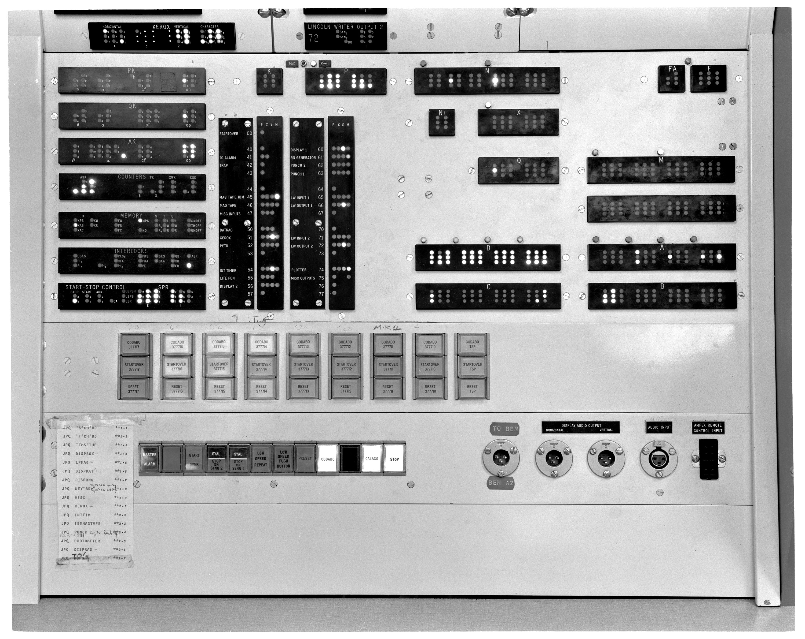
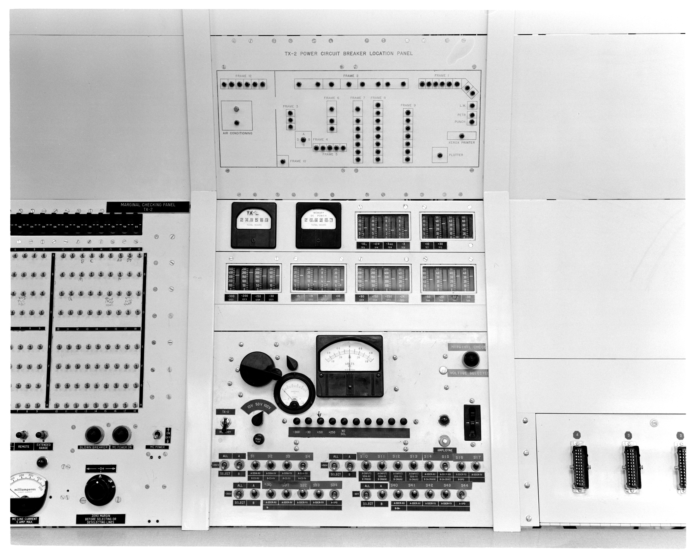
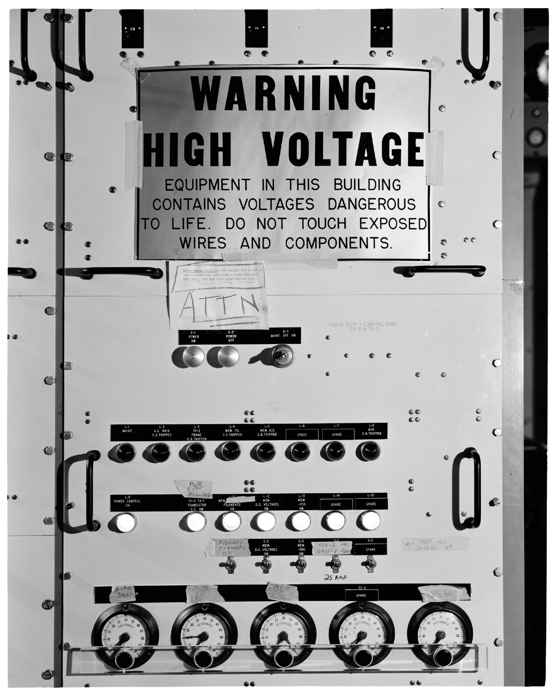
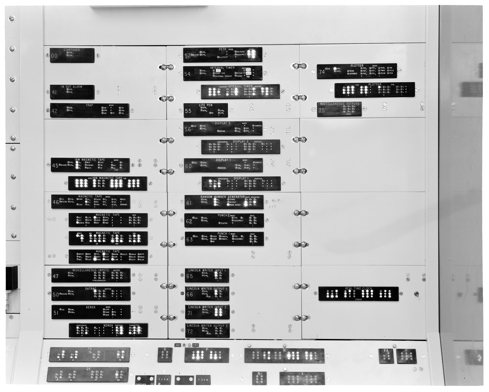
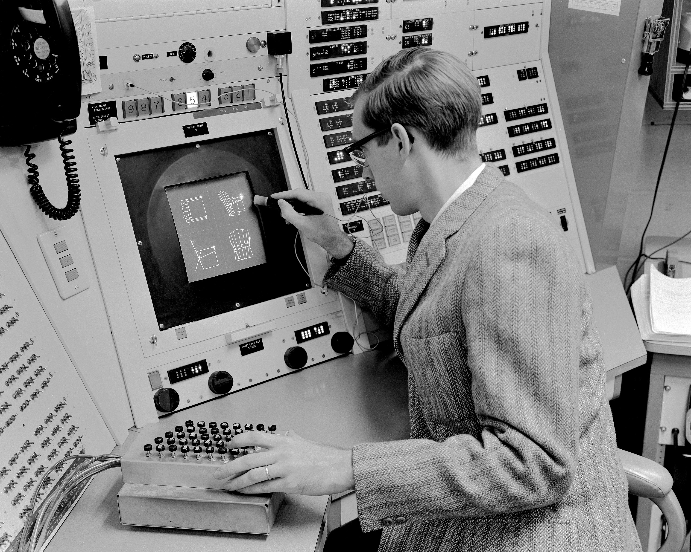
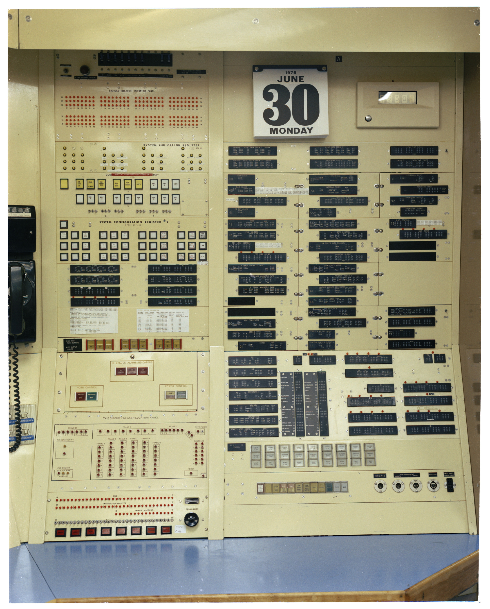

# Photographs

## Lincoln Lab 2022-10-31 Release

I asked Lincoln Lab about release of photographs of the TX-2's
console.  On 2022-10-31 they kindly provided a number of photographs
of the computer in use and several parts of the console.  Some of
these photos are also included in the TX-2 Technical Manual, but they
are generally low-resolution cropped images.

The general layout of the room is shown in Figure 5-1 on page 5-2
(physical page 127) of [The TX-2 Users
Handbook](https://archive.org/details/tx-2-users-handbook-nov-63/page/n126/mode/1up).

### P91-113: 1961-03-28, Toggle switch storage panel

The toggle switches are at the bottom of the panel.  At the top is a
calendar, and below that are indicators showing the contents of the
system registers (K, P, N, FA, F, N, X, Q, M, D, A, B, C, though not
all of these are programmer-accessible).

On the right of this panel are sequence number status indicators,
though the sequence number assignments are closer to those described
in the TX-2 User's Handbook.

### P91-185: 1962-06-20, Unidentified woman working at TX-2 Control Desk Using the Lincoln Writer

### P91-211: 1962-08-12, Ivan Sutherland using Sketchpad graphics program at the TX-2 Computer

Sutherland is using the Lite Pen in combination with a push-button
unit, perhaps the same unit shown at foot level on the left of the
previous photograph.

### P91-206: 1962-10-29, Two unidentified women working at the TX-2 Control Desk, console

Here the CRT is visible in Frame 1, not having yet been removed.  The
woman on the right is operating the Lincoln Writer.  At the extreme
right of the photograph is the photoelectric tape reader.

### P91-214: 1963-02-28, Console Indicator Panel

### P91-215: 1963-02-28, Alarm and Sync Systems

![P91-215: 02/28/1963, A Cropped version of this photo, showing the
right side of the photo, appears is in: "TX-2 Users Handbook," Lincoln
Manual No. 45, July, 1961, p. 5-11, Figure 5-5.: Alarms, conditions
and Action Pushbuttons. [same photo also appears on pp. 5-16 and
5-18]; A Cropped version of this photo, showing the left side of the
photo, appears in: "TX-2 Users Handbook," Lincoln Manual No. 45, July,
1961, p. 5-21, Figure 5-9.: TX-2 Sync
System.](photos/Lincoln-Lab/2022-10-31/P91-215_RR_135748.jpg)

### P91-217: 1963-02-28 Maintenance Console

The Maintenance Console is used for marginal testing (varying the
power supply voltage to identify components which are about to fail).
It also contains the operating time counters.

### P91-218: 1963-02-28 Power Panel

Below the main warning sign is a notice explaining how to shut the
system down properly before turning off the power.

### P91-219: 1963-02-28 IN-OUT Buffers and Special Indicators

This photograph again shows the status indicators for each of the
TX-2's sequences.

### P91-233: 1963-12-06 Timothy Johnson uses Sketchpad on the TX-2 computer

### 1975-06-11, John Frankovich (L) and Omar Wheeler (R) working at the TX-2 Main Console (Frame 1)

Photograph CP91-71 (1975-06-11) shows John Frankovich (Left) and Omar
Wheeler (Right) working at the TX-2 Main Console (Frame 1).  The
circuit breaker location and console indicator panels are behind
Wheeler.  These are shown in more detail below.  The CRT is missing
from Frame 1, presumably having been removed some time after Ivan
Sutherland's work on Sketchpad.

### 1975-07-25: Circuit breaker location panel

Photograph CP91-119, 1975-07-25, shows the panels on the far right of
Frame 1.The circuit breaker location panel is at the bottom left of
this photograph.  On the right are the status indicators of the system
sequences.  Many of these are documented in the TX-2 User's Handbook.

This photograph is over ten years more recent than the version of the
TX-2 User's Handbook that we have and so some sequences shown on this
panel are different.  These changes are described in [Sequence
Changes](commentary/sequence-changes.md).

### Original Captions

The captions originally supplied by Lincoln Lab for the photos in this
release are [here](photos/Lincoln-Lab/2022-10-31/original-captions.txt).
