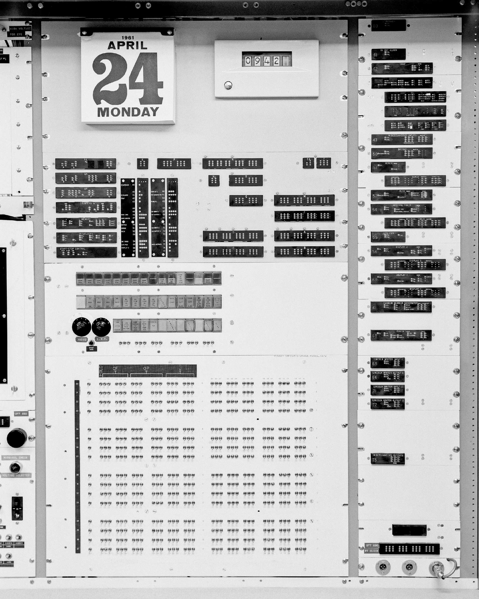

# Photographs

## Lincoln Lab 2022-10-31 Release

I asked Lincoln Lab about release of photographs of the TX-2's
console.  On 2022-10-31 they kindly provided a number of photographs
of the computer in use and several parts of the console.  Some of
these photos are also included in the TX-2 Technical Manual, but they
are generally low-resolution cropped images.

### 06/11/1975, John Frankovich (L) and Omar Wheeler (R) working at the TX-2 Main Console (Frame 1)

### 07/25/1975, Circuit breaker location panel

### P91-113: 03/28/1961, Toggle switch storage panel

### P91-185: 06/20/1962, Unidentified woman working at TX-2 Control Desk Using the Lincoln Writer

### P91-206: 10/29/1962,  Two unidentified women working at the TX-2 Control Desk, console

### P91-211: 12/08/1962, Ivan Sutherland using Sketchpad graphics program at the TX-2 Computer.

### P91-214: Console Indicator Panel

### P91-215: Alarm and Sync Systems

![P91-215: 02/28/1963, A Cropped version of this photo, showing the
right side of the photo, appears is in: "TX-2 Users Handbook," Lincoln
Manual No. 45, July, 1961, p. 5-11, Figure 5-5.: Alarms, conditions
and Action Pushbuttons. [same photo also appears on pp. 5-16 and
5-18]; A Cropped version of this photo, showing the left side of the
photo, appears in: "TX-2 Users Handbook," Lincoln Manual No. 45, July,
1961, p. 5-21, Figure 5-9.: TX-2 Sync
System.](photos/Lincoln-Lab/2022-10-31/P91-215_RR_135748.jpg)

### Maintenance Console

### Power Panel

### IN-OUT Buffers and Special Indicators

### Timothy Johnson uses Sketchpad on the TX-2 computer

